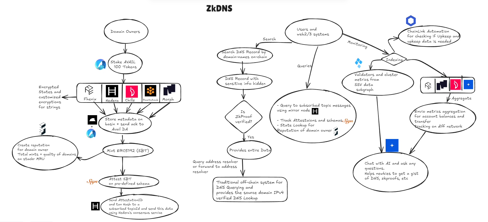

# ZkDNS

A secure and transparent way of querying DNS servers using zkproofs.

## Table of Contents

- [Project Description](#project-description)
- [Running the Project](#running-the-project)
- [Flow Chart and System Design](#flow-chart-and-system-design)
- [Partners and Technologies](#partners-and-technologies)
  - [Fhenix Integration](#fhenix)
  - [Hedera Network Integration](#hedera-network)
  - [Chillz Integration](#chillz)
  - [Morph Integration](#morph)
  - [Galadriel Integration](#galadriel)
  - [Sign Protocol Integration](#sign-protocol)
  - [ChainLink Integration](#chainlink)
  - [Tableland Basin Integration](#tableland-basin)
  - [Avail Integration](#avail)
  - [Stackr Integration](#stackr)
  - [Envio Integration](#envio)
  - [SSV Network Integration](#ssv-network)
  - [Rootstock](#rootstock)

## Project Description

ZkDNS is an innovative solution designed to tackle data breaches in web2/web3 systems caused by phishing, DoS attacks, and other vulnerabilities. By providing a private computing protocol on-chain for DNS lookups, ZkDNS bridges the gap between web2 and web3, offering a secure and transparent method for querying DNS servers using zero-knowledge proofs.

The project allows domain owners to stake AVAIL tokens to access utility for adding domain records to the on-chain domain registry. This staking mechanism also serves as a deterrent against malicious entries, as domain owners can be slashed for such behavior. Users can add various DNS records, including domain name, address resolver, record type, expiry date, and contact information.

ZkDNS utilizes a range of cutting-edge technologies and protocols to ensure security, transparency, and efficiency:

- Zero-knowledge Soul Bound Tokens (zkSBTs) for minting domain records
- Sign Protocol for attestation of transactions
- Hedera Consensus Service for broadcasting attestation IDs
- Tableland's Basin S3 object store for metadata storage
- Multiple network support including Fhenix, Hedera, Morph, and Chillz
- Fully Homomorphic Encryption (FHE) for on-chain storage of sensitive data
- Chainlink Automation for system upkeep checks
- Stackr's Micro Rollup SDK for reputation scoring
- Galadriel devnet for AI-assisted user support
- Hypersync for transaction monitoring
- SSV Network's subgraph for network metrics

This comprehensive approach creates a peer-driven ecosystem that enhances security, transparency, and usability in DNS management and querying.

## Running the Project

1.) Setting up `Signattestations` for **Sign protocol attestations, Hedera's consensus service, querying SSV data**: 

fill up .env and use .env.example for reference
```sh
cd Signattestations
yarn install
nodemon src/index.js
```

2.) Setting up `Off-chain` for **Envio python client, Traditional DNS lookup**:

fill up .env and use .env.example for reference
```sh
cd Off-chain
python -m venv env
env/Scripts/activate
pip install -r requirements.txt
cd compute
python main.py
```

3.) Setting up `rollup` for **Stackr MRU**:

fill up .env and use .env.example for reference
```sh
cd rollup
npm i
npm start
```

4.) Setting up `proofStorage` for **zkproofs, tableland basin cli** (Linux Based using wsl)

fill up .env and use .env.example for reference
```sh
cd proofStorage
wsl
python -m venv env
source env/bin/activate
pip install -r requirements.txt
cd src
python main.py
```

5.) Final frontend `zkdns`

fill up .env and use .env.example for reference
```sh
cd zkdns
yarn install
yarn start
```
Done!

## Flow Chart and System Design



## Partners and Technologies

For running the project : [Running the Project](#running-the-project)

### Fhenix
  - **Deployment**: [https://explorer.helium.fhenix.zone/address/0xb5ddC78A82227C25864F269a0fc58d4166AA26b0](https://explorer.helium.fhenix.zone/address/0xb5ddC78A82227C25864F269a0fc58d4166AA26b0)

  - **Why it's used:** Fhenix provides on-chain storage of sensitive data by encrypting and decrypting integers and addresses using Fully Homomorphic Encryption (FHE) library. The Project needed a solution for storing data in a confidential manner and doing so with Fhenix provides storing sensitive data on-chain. The global state variables stores the encrypted data which makes it secure for third party trying to access the data via a rpc call.

  - **How it's used:** All the sensitive Domain information including address resolver, contact are encrypted and decrypted on-chain. We've custom-modified the FHE behavior to enable storing, encrypting, and decrypting strings. The process involves hashing using bitwise manipulation to convert strings into unique bytes32 format, which is then converted to an integer for on-chain storage. The unique integer is mapped to the actual string on the client-side and decrypted there. We use envio's hypersync client to query data from Fhenix testnet blocks, transactions and events.

  - **Solditiy Code section:** [https://github.com/dhananjaypai08/ZkDNS/blob/master/zkdns/src/contracts/zkdnsFhenix.sol](https://github.com/dhananjaypai08/ZkDNS/blob/master/zkdns/src/contracts/zkdnsFhenix.sol)
  - **Customized enryption technique code:** [https://github.com/dhananjaypai08/ZkDNS/blob/master/zkdns/src/components/AddDNSRecord.js#L235](https://github.com/dhananjaypai08/ZkDNS/blob/master/zkdns/src/components/AddDNSRecord.js#L235)
  - Integration is done from frontend at: ***zkdns/src/pages/Home.js*** and ***zkdns/src/components/AddDNSRecord.js***

  - **Usage and benefits:** Fhenix's FHE capabilities allow ZkDNS to store sensitive DNS information on-chain while maintaining privacy and security. This is crucial for protecting domain owner information and preventing unauthorized access to DNS records. 

  - **What makes it stand out:** The ability to encrypt and decrypt strings on-chain sets ZkDNS apart, as it allows for more versatile and secure data management compared to systems that can only encrypt integers or addresses. Additional network monitoring using envio's hypersync to track and query block data, transaction data and wallet data.

### Hedera Network

**Deployment**: [https://hashscan.io/testnet/contract/0.0.4801020](https://hashscan.io/testnet/contract/0.0.4801020)

**Why it's used:** Hedera Network provides high security through asynchronous Byzantine Fault Tolerance (aBFT) and uses the hashgraph sdk.

**How it's used:** ZkDNS utilizes Hedera's Smart Contract Service (HSCS) for deploying and interacting with smart contracts and also minting SBT's(ERC5192), and the Hedera Consensus Service (HCS) for broadcasting attestation IDs.

**Solditiy Code section:** [https://github.com/dhananjaypai08/ZkDNS/blob/master/zkdns/src/contracts/ZKDNS.sol](https://github.com/dhananjaypai08/ZkDNS/blob/master/zkdns/src/contracts/ZKDNS.sol)
**HCS code section:** [https://github.com/dhananjaypai08/ZkDNS/blob/master/Signattestations/src/index.js#L266](https://github.com/dhananjaypai08/ZkDNS/blob/master/Signattestations/src/index.js#L266)

**Usage and benefits:** 
1. HSCS enables secure and efficient execution of ZkDNS smart contracts.
2. HCS is used to message attestation IDs, ensuring transparent and tamper-proof record-keeping of DNS-related transactions.

**What makes it stand out:** Hedera's unique consensus algorithm and high-security features provide ZkDNS with a robust foundation for its decentralized DNS management system, offering unparalleled security and efficiency compared to traditional blockchain networks.

### Chillz

**Deployment**: [https://testnet.chiliscan.com/address/0x3A92c403CcfD005C19B4a75E8ee178f3963dB85C](https://testnet.chiliscan.com/address/0x3A92c403CcfD005C19B4a75E8ee178f3963dB85C)

**Why it's used:** Chillz Spice testnetwork is used to eliminate network barriers for domain owners when tokenizing assets, bridging web2 infrastructure to web3.

**How it's used:** ZkDNS deploys smart contracts on the Chillz Spice testnetwork, allowing domain owners to tokenize their DNS records across multiple networks.

**Solditiy Code section:** [https://github.com/dhananjaypai08/ZkDNS/blob/master/zkdns/src/contracts/ZKDNS.sol](https://github.com/dhananjaypai08/ZkDNS/blob/master/zkdns/src/contracts/ZKDNS.sol)

**Usage and benefits:** 
1. Provides an additional network option for domain tokenization.
2. Integrates with Chainlink VRF Automation for upkeep checks, ensuring system availability and alerting capabilities.

**What makes it stand out:** The integration with Chillz expands the reach of ZkDNS, making it more accessible to a wider range of users and enhancing its interoperability across different blockchain ecosystems.

### Morph

**Deployment**: [https://explorer-holesky.morphl2.io/address/0x5894F81C558F1A302CE81d31F2562D2b19f7DAfd](https://explorer-holesky.morphl2.io/address/0x5894F81C558F1A302CE81d31F2562D2b19f7DAfd)

**Why it's used:** Morph Holesky testnetwork is utilized to make tokenizing of domains available on a network that provides high security and transaction throughput with zkEVM capabilities.

**How it's used:** ZkDNS deploys contracts on the Morph network, leveraging its zkEVM for efficient and secure domain tokenization.

**Solditiy Code section:** [https://github.com/dhananjaypai08/ZkDNS/blob/master/zkdns/src/contracts/ChainLinkUtility.sol](https://github.com/dhananjaypai08/ZkDNS/blob/master/zkdns/src/contracts/ChainLinkUtility.sol)

**Usage and benefits:** 
1. Enables high-throughput, secure tokenization of domains.
2. Utilizes zkEVM for improved scalability and lower transaction costs.
3. Integrates with Chainlink Automation for system upkeep checks.

**What makes it stand out:** The use of Morph's zkEVM technology allows ZkDNS to offer faster, more cost-effective domain tokenization while maintaining high security standards.

### Galadriel

**Deployment**: [https://explorer.galadriel.com/address/0x3A92c403CcfD005C19B4a75E8ee178f3963dB85C](https://explorer.galadriel.com/address/0x3A92c403CcfD005C19B4a75E8ee178f3963dB85C)

**Why it's used:** Galadriel devnet is employed to provide an AI-powered support system for users who are new to web3, zkproofs, or DNS systems.

**How it's used:** Users can switch their network to Galadriel devnet using the WalletConnect appkit to interact with an AI agent for support and information.

**Solditiy Code section:** [https://github.com/dhananjaypai08/ZkDNS/blob/master/zkdns/src/contracts/ChatAI.sol](https://github.com/dhananjaypai08/ZkDNS/blob/master/zkdns/src/contracts/ChatAI.sol)
**Integration frontend section**: [https://github.com/dhananjaypai08/ZkDNS/blob/master/zkdns/src/components/ChatAI.js](https://github.com/dhananjaypai08/ZkDNS/blob/master/zkdns/src/components/ChatAI.js)

**Usage and benefits:** 
1. Offers an intuitive, AI-powered support system for users.
2. Reduces the learning curve for new users entering the web3 space.
3. Offloads compute power requirements from the user's machine.

**What makes it stand out:** The integration of an AI agent on Galadriel devnet sets ZkDNS apart by providing accessible, on-demand support, making the platform more user-friendly and reducing barriers to entry for newcomers to blockchain technology.

### Sign Protocol

**Schema Deployment:** [https://testnet-scan.sign.global/schema/onchain_evm_11155111_0x76](https://testnet-scan.sign.global/schema/onchain_evm_11155111_0x76)

**Why it's used:** Sign Protocol is utilized for attesting transactions and creating verifiable data on-chain.

**How it's used:** When a user adds a DNS record, the transaction is attested using Sign Protocol's schema. The ZkDNS smart contract acts as a reliable third party for authenticating verifiable data on-chain.

**Code section:** [https://github.com/dhananjaypai08/ZkDNS/blob/master/Signattestations/src/index.js#L159](https://github.com/dhananjaypai08/ZkDNS/blob/master/Signattestations/src/index.js#L159)

**Usage and benefits:** 
1. Provides a secure method for attesting DNS record additions.
2. Enhances the trustworthiness of the DNS records by creating verifiable on-chain data.
3. Allows users to track attestations and understand the schema behind them.

**What makes it stand out:** The use of Sign Protocol adds an extra layer of verification to ZkDNS, making it more resistant to fraud and enhancing the overall integrity of the DNS management system.

### ChainLink

**Why it's used:** Chainlink is employed for Automation to ensure system availability and perform regular upkeep checks.

**How it's used:** ZkDNS integrates Chainlink Automation on the Morph and Chillz Spice networks to check the upkeep of data and determine if updates to upkeep checks are necessary within the system.

**Code section:** [https://github.com/dhananjaypai08/ZkDNS/blob/master/zkdns/src/contracts/ChainLinkUtility.sol](https://github.com/dhananjaypai08/ZkDNS/blob/master/zkdns/src/contracts/ChainLinkUtility.sol)

**Usage and benefits:** 
1. Ensures continuous availability of the ZkDNS system.
2. Provides automated alerts for system maintenance needs.
3. Enhances the reliability of the DNS record management process.

**What makes it stand out:** The integration of Chainlink VRF Automation sets ZkDNS apart by providing a decentralized, tamper-proof method for maintaining system health and ensuring high availability of DNS services.

### Tableland Basin

**Why it's used:** Tableland's Basin S3 object store is used for securely storing metadata with sensitive information.

**How it's used:** After a DNS record is added and attested, the metadata containing sensitive information is saved in Tableland's Basin S3 object store.

**Code section:** [https://github.com/dhananjaypai08/ZkDNS/blob/master/proofStorage/src/main.py#L57](https://github.com/dhananjaypai08/ZkDNS/blob/master/proofStorage/src/main.py#L57)

**Usage and benefits:** 
1. Provides a secure, decentralized storage solution for sensitive DNS metadata.
2. Ensures that sensitive information is not directly stored on-chain, enhancing privacy.
3. Allows for efficient retrieval of DNS record metadata when needed.

**What makes it stand out:** The use of Tableland Basin allows ZkDNS to offer a unique combination of on-chain verification and off-chain secure storage, providing a comprehensive solution for managing sensitive DNS data.

### Avail

**Why it's used:** Avail is used as a staking mechanism for domain owners to access the DNS record addition system and as a deterrent against malicious entries.

**How it's used:** Domain owners stake 100 AVAIL tokens to access the add DNS record system. These tokens can be slashed in case of malicious entries, and owners can unstake their tokens at any time.

**Code section staking:** [https://github.com/dhananjaypai08/ZkDNS/blob/master/zkdns/src/components/AddDNSRecord.js#L88](https://github.com/dhananjaypai08/ZkDNS/blob/master/zkdns/src/components/AddDNSRecord.js#L88)
**Code section send data to avail:** [https://github.com/dhananjaypai08/ZkDNS/blob/master/zkdns/src/components/AddDNSRecord.js#L119](https://github.com/dhananjaypai08/ZkDNS/blob/master/zkdns/src/components/AddDNSRecord.js#L119)

**Usage and benefits:** 
1. Provides an economic incentive for honest behavior in DNS record management.
2. Allows for a decentralized governance model in managing DNS records.
3. Enhances the security of the DNS system by requiring a stake from domain owners.

**What makes it stand out:** The integration of Avail for staking introduces a novel approach to DNS management, creating a self-regulating system that incentivizes honest behavior and penalizes malicious activities.

### Stackr

**Why it's used:** Stackr's Micro Rollup SDK is employed for implementing a reputation scoring system for domain owners.

**How it's used:** ZkDNS uses Stackr to calculate and manage reputation scores based on the number of domains added to the registry and the quality of mints. The state transitions, domains, and state machine are configured and integrated with the frontend.

**Code section:** [https://github.com/dhananjaypai08/ZkDNS/tree/master/rollup](https://github.com/dhananjaypai08/ZkDNS/tree/master/rollup)

**Usage and benefits:** 
1. Enables a peer-driven ecosystem with increased interactivity.
2. Provides transparent reputation scoring for domain owners.
3. Allows users to view their reputation score from the micro rollup state information.

**What makes it stand out:** The implementation of a reputation system using Stackr's Micro Rollup SDK adds a unique layer of trust and accountability to ZkDNS, fostering a more engaged and responsible community of domain owners.

### Envio

**Why it's used:** Envio is utilized for effective monitoring and understanding of on-chain transactions and verifications.

**How it's used:** ZkDNS uses the Hypersync Python client to aggregate and index data from Chillz, Fhenix, and Galadriel testnets, providing insights into block additions, distributions, and timestamp trends.

**Code section1:** [https://github.com/dhananjaypai08/ZkDNS/blob/master/Off-chain/compute/main.py#L105](https://github.com/dhananjaypai08/ZkDNS/blob/master/Off-chain/compute/main.py#L105)
**Code section2:** [https://github.com/dhananjaypai08/ZkDNS/blob/master/Off-chain/compute/envioClient.py](https://github.com/dhananjaypai08/ZkDNS/blob/master/Off-chain/compute/envioClient.py)

**Usage and benefits:** 
1. Offers comprehensive monitoring of on-chain activities across multiple networks.
2. Provides valuable insights into network performance and transaction patterns.
3. Enhances transparency and allows for better system optimization.

**What makes it stand out:** The integration of Envio's monitoring capabilities gives ZkDNS a powerful tool for system analysis and optimization, setting it apart from other DNS management solutions by offering deep insights into on-chain activities.

### SSV Network

**Why it's used:** SSV Network's subgraph is employed for querying and displaying network metrics, providing transparency to domain owners.

**How it's used:** ZkDNS uses SSV Network's subgraph to query and display metrics such as account balances of validators, cluster deposits, average network fee index, and active validator metrics.

**Code section:** [https://github.com/dhananjaypai08/ZkDNS/blob/master/zkdns/src/components/SSVMetrics.js](https://github.com/dhananjaypai08/ZkDNS/blob/master/zkdns/src/components/SSVMetrics.js)

**Usage and benefits:** 
1. Provides transparent insights into network operations.
2. Allows domain owners to assess the health and activity of the validator network.
3. Enhances trust in the system by offering detailed network metrics.

**What makes it stand out:** The integration of SSV Network's subgraph for network metrics offers unparalleled transparency in ZkDNS operations, setting it apart by providing domain owners with detailed insights into the underlying infrastructure.

### Rootstock

**Deployment** [https://explorer.testnet.rootstock.io/address/0x3a92c403ccfd005c19b4a75e8ee178f3963db85c](https://explorer.testnet.rootstock.io/address/0x3a92c403ccfd005c19b4a75e8ee178f3963db85c)

**Why it's used:** Rootstock is utilized to expand the capabilities of ZkDNS to include Bitcoin-based transactions for adding DNS records on-chain.

**How it's used:** ZkDNS leverages Rootstock's EVM compatibility to allow transactions for adding DNS records using Bitcoin, in addition to other supported networks.

**Code section:** [https://github.com/dhananjaypai08/ZkDNS/blob/master/zkdns/src/contracts/ZKDNS.sol](https://github.com/dhananjaypai08/ZkDNS/blob/master/zkdns/src/contracts/ZKDNS.sol)

**Usage and benefits:** 
1. Enables DNS record transactions using Bitcoin, leveraging its high security.
2. Expands the reach of ZkDNS to Bitcoin users and enthusiasts.
3. Provides an additional layer of security and decentralization through Bitcoin integration.

**What makes it stand out:** The integration of Rootstock sets ZkDNS apart by bridging the gap between DNS management and the Bitcoin ecosystem, offering a unique solution that leverages the security and popularity of Bitcoin for DNS-related transactions.

### 🤠 Contributions
Open for contributions. Just clone and follow the installation. Make changes and raise a PR detailing about the changes made.
